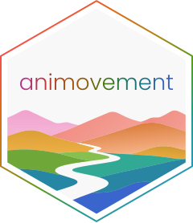

---
format:
  gfm:
    # Without this, pandoc appends ".png" to extensionless image URLs and every
    # shields.io / R-universe badge in this README breaks.
    default-image-extension: ""
knitr:
  opts_chunk:
    fig.path: "man/figures/README-"
---

<!-- README.md is generated from README.qmd. Please edit that file -->

```{r, include = FALSE}
knitr::opts_chunk$set(
  collapse = TRUE,
  comment = "#>",
  out.width = "100%"
)

# The startup banner is styled with ANSI escapes, which are noise in a plain
# markdown README.
options(animovement.styling = FALSE)
```

# animovement <a href='https://animovement.dev/animovement/'></a>

<!-- badges: start -->

[](https://doi.org/10.5281/zenodo.13235277)
[](https://github.com/animovement/animovement/actions/workflows/R-CMD-check.yaml)
[](https://animovement.r-universe.dev)
[](https://codecov.io/gh/animovement/animovement)
[](https://animovement.zulipchat.com)
<!-- badges: end -->

## Overview

[animovement](https://animovement.dev) is a "meta-package" for analysing movement across space and time. Whether your data comes from pose estimation, centroid tracking, a trackball or a treadmill, the analysis follows much the same arc: read the data, check what you got, clean it, put it in a sensible frame of reference, derive the metrics you care about, and look at the result. The animovement ecosystem splits that arc into focused packages, each doing one part well — and the *animovement* package bundles them, so a single `library(animovement)` gives you the whole workflow with versions and conflicts sorted out for you.

It includes a core set of packages that are loaded on startup:

* [`anicore`](https://animovement.dev/anicore) provides the core data structures that the rest of the ecosystem is built on — the shared representation that lets these packages hand data to one another.

* [`aniread`](https://animovement.dev/aniread) reads and writes movement data, turning the output of tracking tools and recording hardware into that common structure.

* [`anicheck`](https://animovement.dev/anicheck) diagnoses data quality, so you find the gaps, outliers and low-confidence stretches before they reach your results.

* [`aniprocess`](https://animovement.dev/aniprocess) does signal processing and filtering — smoothing, interpolating and otherwise cleaning up trajectories.

* [`anispace`](https://animovement.dev/anispace) handles spatial transformations, such as changing the origin, rotating, or converting between coordinate systems.

* [`animetric`](https://animovement.dev/animetric) calculates movement-based metrics, from kinematics through to summary statistics.

* [`anivis`](https://animovement.dev/anivis) visualises movement data and diagnostics.

Tutorials showing these packages working together live at [animovement.dev](https://animovement.dev); each package's own function reference lives on its own site, linked above. This page documents the meta-package itself — attaching the suite, tailoring it, and keeping it up to date.

*We work actively with the developers of the Python [`movement`](https://movement.neuroinformatics.dev/) package to reach similar data standards, workflows and use cases; if you prefer analysing your data in Python, we highly recommend using [`movement`](https://movement.neuroinformatics.dev/).*

## Installation

The animovement packages are published on [R-universe](https://animovement.r-universe.dev) rather than CRAN, so the repository has to be named when installing:

```{r, eval=FALSE}
install.packages('animovement', repos = c('https://animovement.r-universe.dev', 'https://cloud.r-project.org'))
```

Installing the meta-package brings the whole ecosystem with it.

## Usage

When loading the package, the versions and any conflicts are listed:

```{r}
library(animovement)
```

If a function name is exported by two attached packages, the one attached later masks the other, and the startup message says so. `animovement_conflicts()` lists them again at any point, and works for any attached packages — not just ours. To see what is currently in your animovement, and how it is doing:

```{r, eval=FALSE}
animovement_packages()  # Which packages are attached as part of animovement
animovement_conflicts() # Conflicts with other attached packages
animovement_sitrep()    # Versions, and whether anything is out of date
animovement_detach()    # Remove them from the search path again
```

## Extending

Most analyses need more than the core set. `animovement_extend()` adds packages to your animovement for the session — attaching them, checking their conflicts alongside the core ones, and including them in everything that follows, such as `animovement_update()`:

```{r, eval=FALSE}
animovement_extend(ggplot2, tidyr, install = TRUE)
```

For a set that belongs to a project rather than a session, put a file named `.animovement` in the project root and list the packages you want — one per line, or separated by commas or spaces:

```
anicore, aniread, aniprocess
ggplot2
```

When this file is present it *replaces* the standard core set, so list everything the project needs. That makes the project's dependencies explicit to anyone who opens it, and keeps `library(animovement)` meaning the same thing for all of them.

Options can be set in the same file by prefixing them with `_opt_` and placing them before the package names (for example `_opt_animovement.install = TRUE`), or set directly in R:

- `options(animovement.quiet = TRUE)` — silence startup, conflict and install messages
- `options(animovement.styling = FALSE)` — disable styling of console output
- `options(animovement.extend = c(...))` — extend before `library(animovement)`
- `options(animovement.install = TRUE)` — install missing packages on attach

## Keeping up to date

The ecosystem packages are released independently, so they drift out of step if updated one at a time. These two check and fix the whole set together:

```{r, eval=FALSE}
animovement_update()  # Check for updates, and install them
animovement_install() # Install any ecosystem packages you are missing
```

Both look in the animovement R-universe by default, via `animovement_repos()`. To point the rest of your session at the same repositories:

```{r, eval=FALSE}
options(repos = animovement_repos())
```

To keep installation light, functionality that only some users need is a soft dependency rather than a hard one. Instead of meeting them one error message at a time, take them all at once:

```{r, eval=FALSE}
animovement_show_suggested()    # What the ecosystem suggests
animovement_install_suggested() # Install all of it
```

## Getting help and contributing

**If your favourite type of movement data is not currently supported, we would love to get a sample of your data to support it!**

- For questions and discussion about animovement, movement data and analysis, come and [chat with us on Zulip](https://animovement.zulipchat.com).

- Most issues belong on the repository of an individual package — `aniread` for a reader that trips up, `aniprocess` for a filter that misbehaves. If you think you have found a bug in the meta-package itself, [open an issue here](https://github.com/animovement/animovement/issues).

- Either way, a [reprex](https://reprex.tidyverse.org/articles/learn-reprex.html) (a minimal, reproducible example) is the fastest route to an answer.

- See [CONTRIBUTING.md](.github/CONTRIBUTING.md) for the pull request process.

## Citation

If you enjoy the package, please make sure to cite it. To cite *animovement* in publications use:

```{r}
citation("animovement")
```
