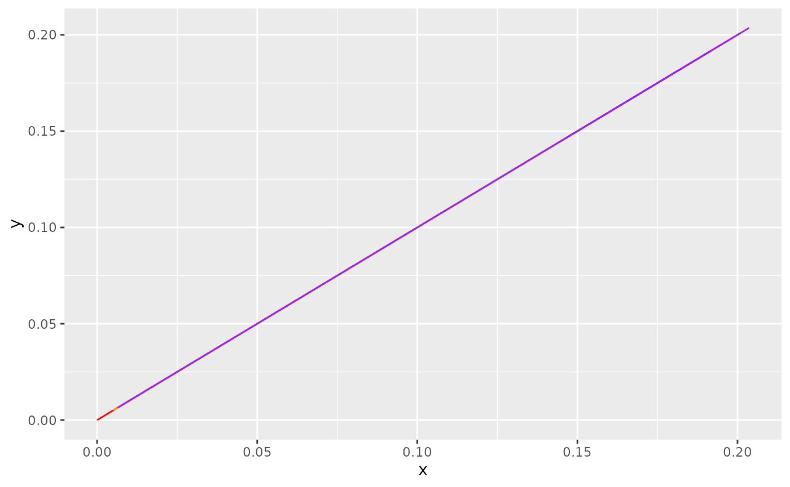

# Clean tracks

``` r

library(animovement)
#> -- Attaching packages ------------------------------------- animovement 0.7.3 --
#> v aniframe   0.6.0     v anicheck   0.2.0
#> v aniread    0.5.0     v animetric  0.3.2
#> v anispace   0.1.3     v anivis     0.2.0
#> v aniprocess 0.2.0
library(tibble)
library(dplyr, warn.conflicts = FALSE)
library(here)
#> here() starts at /home/runner/work/animovement/animovement
here::i_am("vignettes/articles/clean-tracks.Rmd")
#> here() starts at /home/runner/work/animovement/animovement
```

The next step in our workflow is to clean the tracks. This step commonly
covers three separate components:

- [**Outlier detection**](#outlier-detection)
- [**Interpolation**](#interpolation)
- [**Smoothing**](#smoothing)

Although these are not always completely separate steps in practice, we
will treat them as such to ensure the integrity of our tracks.

## Interpolation

In case we removed any outliers, we can now interpolate across the gaps
created.

**TO BE CONTINUED…**

## Smoothing

All there is left to do is smooth our tracks, which is done using the
`smooth_tracks()` function. The smoothing itself is super simple.
`smooth_tracks()` provides a few different options:

- `roll_mean`
- `roll_median`
- **SOON** `savitsky_golay`

For the rolling filters you can provide the `window_width`, i.e. how
many observations to use in the rolling filter. The filters result in
some `NA` values at the beginning and end of your data.

An important point about `smooth_tracks()` is that, instead of using our
`x` and `y` values, it first back-transforms into the raw values
obtained from your sensors (which are effectively “differences” between
coordinates, so `dx` and `dy`) and performs the smoothing on them,
before finally converting back to `x` and `y`. This may seem strange if
you have previously worked with tracking data from computer vision or
GPS loggers. However, whereas those modalities would return to the
“true” coordinates after an outlier, mouse sensors do not. So the only
way we can identify rogue values is by filtering those raw values.

Let’s try smoothing our data with a `rolling_mean` filter with 0.5
second (30 observations at at a sampling rate of 60Hz) window width. In
case we work with multiple keypoints and/or individuals we can use
`group_by` with our metadata for a *tidyverse*-friendly workflow.

``` r

df_rollmedian <- df |>
  filter_aniframe(method = "rollmedian", 
                  window_width = 3, 
                  use_derivatives = TRUE)
df_kalman <- df |>
  filter_aniframe(method = "kalman", 
                  sampling_rate = 60, 
                  use_derivatives = TRUE)
df_sgolay <- df |>
  filter_aniframe(method = "sgolay", 
                  sampling_rate = 60, 
                  use_derivatives = TRUE)
df_lowpass <- df |>
  filter_aniframe(method = "lowpass", 
                  cutoff_freq = 0.1, 
                  sampling_rate = 60, 
                  use_derivatives = TRUE)
```

Let’s visualise how they compare. Note that although the difference may
seem negligible when plotting paths, they may become important when
computing derivatives such as velocity and acceleration.

``` r

library(ggplot2)
ggplot() +
  geom_path(data = df, aes(x, y), colour = "red") +
  geom_path(data = df_rollmedian, aes(x, y), colour = "blue") +
  geom_path(data = df_kalman, aes(x, y), colour = "orange") +
  geom_path(data = df_sgolay, aes(x, y), colour = "purple") +
  geom_path(data = df_lowpass, aes(x, y), colour = "green")
#> Warning: Removed 1 row containing missing values or values outside the scale range
#> (`geom_path()`).
#> Warning: Removed 19 rows containing missing values or values outside the scale range
#> (`geom_path()`).
```



Not that different as the sensors are doing a good job! But we can see
that the smoothed track end a bit further to the left than the raw
version.
