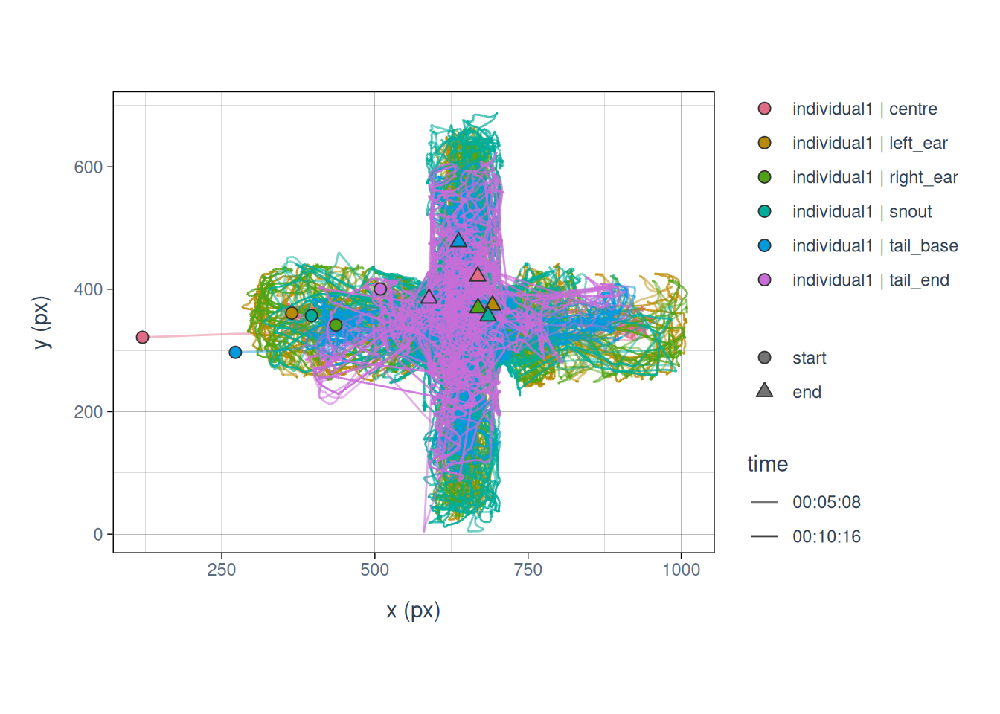

# Analyse DeepLabCut data

In this example, we will go through a full workflow, from reading the
data through inspecting, checking, cleaning, filtering, calculating
kinematics, all the way to useful output metrics. We will stop short of
doing a full-blown statistical analysis, but we will get to the point
that such an analysis would be the logical next step.

First a brief description of the data set: In this experiment, ground
beetles were placed on a trackball to assess whether beetles exhibited
individual traits in their movement patterns. Think of it as personality
through movement. The data was collected by using optical flow sensors
to read the movement of the ball in two locations. The sensors were
connected to Arduino microcontrollers, and the data was collected
through [Bonsai](https://bonsai-rx.org), a visual programming language
that is widely used for experimental control in the neurosciences. We
can then turn this data into normal 2D paths, and whatever follows from
there are the same steps we would use to process any other movement
data. Let’s dig in!

First, we need to load the *animovement* toolbox:

``` r

library(animovement)
```

    -- [1mAttaching packages[22m ------------------------------------- [38;5;33manimovement[39m 0.7.3 --

    [38;5;33mv[39m [38;5;198maniframe  [39m 0.6.0     [38;5;33mv[39m [38;5;198manicheck  [39m 0.2.0
    [38;5;33mv[39m [38;5;198maniread   [39m 0.5.0     [38;5;33mv[39m [38;5;198manimetric [39m 0.3.2
    [38;5;33mv[39m [38;5;198manispace  [39m 0.1.3     [38;5;33mv[39m [38;5;198manivis    [39m 0.2.0
    [38;5;33mv[39m [38;5;198maniprocess[39m 0.2.0     

## Read data

We provide access to sample data with the `get_sample_data`
function[^1], so anyone can try out the analysis on their own too. This
function downloads a sample data set to a temporary location and returns
the path to the data - that way we just have to pass the path to our
data reader function.

``` r

paths <- get_sample_data("sleap")
```

    Downloading sleap data...

Let’s inspect the path:

``` r

paths
```

    [1] "/tmp/RtmpU1Hocj/sleap_single-mouse_EPM.h5"

Next we need to read the data with a `read_` function, which brings the
data into the standardised *aniframe* format. We can see that we get
*two* different paths - remember that we used two sensors to track the
balls motion? - that makes `read_trackball` a special case, because
*animovement* needs to re-create the path from the sensor data. We also
need to specify the `setup`, as the beetle can either be contrained to
only face a single direction on the ball (`setup = "of_fixed"`), or left
to rotate atop the ball freely (`setup = "of_free"`). In the present
experiment the setup was `of_fixed`.

``` r

data <- read_sleap(paths)
```

## Inspect data

Now we have read our data, let’s inspect it:

``` r

data
```

    # Individuals: individual1
    # Keypoints:   centre, left_ear, right_ear, snout, tail_base, tail_end
       individual  keypoint  time     x     y confidence
       <fct>       <fct>    <int> <dbl> <dbl>      <dbl>
     1 individual1 centre       1    NA    NA         NA
     2 individual1 centre       2    NA    NA         NA
     3 individual1 centre       3    NA    NA         NA
     4 individual1 centre       4    NA    NA         NA
     5 individual1 centre       5    NA    NA         NA
     6 individual1 centre       6    NA    NA         NA
     7 individual1 centre       7    NA    NA         NA
     8 individual1 centre       8    NA    NA         NA
     9 individual1 centre       9    NA    NA         NA
    10 individual1 centre      10    NA    NA         NA
    # ℹ 110,900 more rows

We can also inspect the associated metadata:

``` r

get_metadata(data)
```

    ── animovement metadata ────────────────────────────────────────────────────────
    source            (character) : "sleap"
    source_version    (character) : <NA>
    filename          (character) : "sleap_single-mouse_EPM.h5"
    sampling_rate     (numeric)   : <NA>
    start_datetime    (POSIXct)   : <NA>
    variables_what    (character) : "individual, keypoint"
    variables_when    (character) : "time"
    variables_where   (character) : "x, y"
    variables_event   (list)      : "character(0), character(0)"
    unit_space        (factor)    : "px"
                                    [levels: px, none, nm, um, mm, cm, m, km]
    unit_angle        (factor)    : "rad"
                                    [levels: rad, deg]
    unit_time         (factor)    : "frame"
                                    [levels: unknown, frame, ns, us, ms, s, m, h]
    reference_frame   (factor)    : "allocentric"
                                    [levels: allocentric, egocentric]
    coordinate_system (factor)    : "cartesian_2d"
                                    [levels: unknown, cartesian_1d, cartesian_2d, cartesian_3d, polar, cylindrical, spherical]
    origin            (factor)    : "bottom_left"
                                    [levels: bottom_left, top_left]
    y_height          (numeric)   : 861.2433
    connections       (list)      :
    spec_version      (list)      : "1.0.0, 0.1.0"

If we want to change some of the metadata, we can easily do so:

``` r

data <- data |> 
    set_sampling_rate(30)

get_metadata(data)
```

    ── animovement metadata ────────────────────────────────────────────────────────
    source            (character) : "sleap"
    source_version    (character) : <NA>
    filename          (character) : "sleap_single-mouse_EPM.h5"
    sampling_rate     (numeric)   : 30
    start_datetime    (POSIXct)   : <NA>
    variables_what    (character) : "individual, keypoint"
    variables_when    (character) : "time"
    variables_where   (character) : "x, y"
    variables_event   (list)      : "character(0), character(0)"
    unit_space        (factor)    : "px"
                                    [levels: px, none, nm, um, mm, cm, m, km]
    unit_angle        (factor)    : "rad"
                                    [levels: rad, deg]
    unit_time         (factor)    : "s"
                                    [levels: unknown, frame, ns, us, ms, s, m, h]
    reference_frame   (factor)    : "allocentric"
                                    [levels: allocentric, egocentric]
    coordinate_system (factor)    : "cartesian_2d"
                                    [levels: unknown, cartesian_1d, cartesian_2d, cartesian_3d, polar, cylindrical, spherical]
    origin            (factor)    : "bottom_left"
                                    [levels: bottom_left, top_left]
    y_height          (numeric)   : 861.2433
    connections       (list)      :
    spec_version      (list)      : "1.0.0, 0.1.0"

## Check data

The next step is for us to inspect the quality of the data. Common
checks include assessing the confidence we have in the collected data,
which uses the `confidence` variable in the *aniframe*, and assessing
the frequency and distribution of missing values (`NA`) in the data.
However, for this type of trackball data, the readings are very reliable
and it is hard to get a good estimate of the .

``` r

# check_confidence(data)
```

## Remove outliers

Next, we would remove outliers - data points that we have little faith
in. We have introduced a variety of functions for doing this, all
starting with `filter_na`. Bug, again, for this data we would not expect
any outliers.

``` r

data <- data |> 
    filter_na_confidence() |> 
    filter_na_speed(threshold = 1000)
```

## Filter/smooth paths

We could however expect some noise in the sampling process. Thus, we may
want to filter our data, which is commonly done for movement data across
fields, although the preferred method differs between fields. These are
our `filter_` functions. We can try a few different ones to see the
difference. Importantly, for this data, since the raw collected data are
*changes* between timepoints and not absolute positions (\*e.g. position
in an image), we need to convert the data back to its original state, do
the filtering, and then convert back to positions in 2D; luckily,
`filter_aniframe` can do that for us, simply by enabling
`use_derivatives = TRUE`.

``` r

data <- data |> 
    filter_aniframe(
        method = "lowpass", 
        cutoff_freq = 10, 
        sampling_rate = 30, 
        keep_na = FALSE
        )
```

When we are finally happy that our data is of the best possible quality,
then - **and only then** - can we move on to doing calculations based on
our data.

## Calculate kinematics

For this experiment, the researchers were particularly interested in
kinematics and path tortuosity measures.

``` r

data <- data |> 
    calculate_kinematics()
    #calculate_tortuosity()
```

Note that `calculate_tortuosity` uses a sliding window which can be set
by specifying `window_width` (which should be an odd number).

Now the data also has a new class, `aniframe_kin`, which provides a new
way of plotting the data:

``` r

plot(data)
```



## Summarise paths

``` r

data_summary <- data |> 
    summarise_kinematics()

data_summary
```

    # A tibble: 6 × 14
      individual  keypoint  median_speed mad_speed median_acceleration
      <fct>       <fct>            <dbl>     <dbl>               <dbl>
    1 individual1 centre            51.5      53.8            2.16e- 7
    2 individual1 left_ear          70.8      73.0           -6.61e- 1
    3 individual1 right_ear         69.7      72.1            2.29e- 7
    4 individual1 snout             63.0      74.7           -3.46e- 8
    5 individual1 tail_base         48.5      54.2            1.87e- 6
    6 individual1 tail_end          47.3      56.3            1.03e-11
    # ℹ 9 more variables: mad_acceleration <dbl>, median_angular_speed <dbl>,
    #   mad_angular_speed <dbl>, median_angular_velocity <dbl>,
    #   mad_angular_velocity <dbl>, median_angular_acceleration <dbl>,
    #   mad_angular_acceleration <dbl>, median_heading <dbl>, mad_heading <dbl>

[^1]: For a list of the possible data sets, run `?get_sample_data`.
