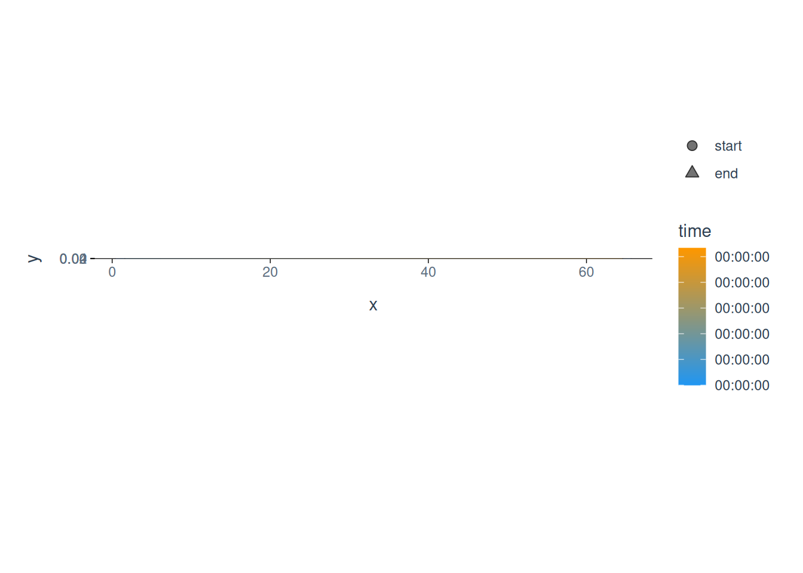

# Analyse trackball data

In this example, we will go through a full workflow, from reading the
data through inspecting, checking, cleaning, filtering, calculating
kinematics, all the way to useful output metrics. We will stop short of
doing a full-blown statistical analysis, but we will get to the point
that such an analysis would be the logical next step.

First a brief description of the data set: In this experiment, ground
beetles were placed on a trackball to assess whether beetles exhibited
individual traits in their movement patterns. Think of it as personality
through movement. The data was collected by using optical flow sensors
to read the movement of the ball in two locations. The sensors were
connected to Arduino microcontrollers, and the data was collected
through [Bonsai](https://bonsai-rx.org), a visual programming language
that is widely used for experimental control in the neurosciences. We
can then turn this data into normal 2D paths, and whatever follows from
there are the same steps we would use to process any other movement
data. Let’s dig in!

First, we need to load the *animovement* toolbox:

``` r

library(animovement)
```

    -- [1mAttaching packages[22m ------------------------------------- [38;5;33manimovement[39m 0.7.3 --

    [38;5;33mv[39m [38;5;198maniframe  [39m 0.6.0     [38;5;33mv[39m [38;5;198manicheck  [39m 0.2.0
    [38;5;33mv[39m [38;5;198maniread   [39m 0.5.0     [38;5;33mv[39m [38;5;198manimetric [39m 0.3.2
    [38;5;33mv[39m [38;5;198manispace  [39m 0.1.3     [38;5;33mv[39m [38;5;198manivis    [39m 0.2.0
    [38;5;33mv[39m [38;5;198maniprocess[39m 0.2.0     

## Read data

We provide access to sample data with the `get_sample_data`
function[^1], so anyone can try out the analysis on their own too. This
function downloads a sample data set to a temporary location and returns
the path to the data - that way we just have to pass the path to our
data reader function.

``` r

paths <- get_sample_data("trackball")
```

    Downloading trackball data...
    Extracting trackball_beetles.zip...

Let’s inspect the path:

``` r

paths
```

    [1] "/tmp/RtmpZGoTc1/trackball_beetles/named_cols_opticalflow_sensor_1.csv"
    [2] "/tmp/RtmpZGoTc1/trackball_beetles/named_cols_opticalflow_sensor_2.csv"

Next we need to read the data with a `read_` function, which brings the
data into the standardised *aniframe* format. We can see that we get
*two* different paths - remember that we used two sensors to track the
balls motion? - that makes `read_trackball` a special case, because
*animovement* needs to re-create the path from the sensor data. We also
need to specify the `setup`, as the beetle can either be contrained to
only face a single direction on the ball (`setup = "of_fixed"`), or left
to rotate atop the ball freely (`setup = "of_free"`). In the present
experiment the setup was `of_fixed`.

``` r

data <- read_trackball(
    paths, 
    setup = "of_fixed", 
    sampling_rate = 60, 
    col_time = 3, 
    col_dx = 1, 
    col_dy = 2,
    ball_diameter = 5,
    dots_per_cm = 155
    )
```

## Inspect data

Now we have read our data, let’s inspect it:

``` r

data
```

    # Keypoints:     centroid
    # Sampling rate: 60 Hz
    # Time:          00:00:00.000 to 00:00:00.267
       keypoint   time     x        y
       <fct>     <dbl> <dbl>    <dbl>
     1 centroid 0       5     0
     2 centroid 0.0167  6     0
     3 centroid 0.0333  6     0
     4 centroid 0.05    7.00  0.00258
     5 centroid 0.0667 12.0   0.0155
     6 centroid 0.0833 16.0   0.0258
     7 centroid 0.1    22.0   0.0258
     8 centroid 0.117  30.0   0.0465
     9 centroid 0.133  30.0   0.0465
    10 centroid 0.15   40.0   0.0465
    11 centroid 0.167  46.0   0.0310
    12 centroid 0.183  52.0   0.0310
    13 centroid 0.2    59.0  -0.00516
    14 centroid 0.217  64.0  -0.00516
    15 centroid 0.233  68.0  -0.0258
    16 centroid 0.25   72.0  -0.0258
    17 centroid 0.267  79.0  -0.00774

We can also inspect the associated metadata:

``` r

get_metadata(data)
```

    ── animovement metadata ────────────────────────────────────────────────────────
    source            (character) : "trackball_bonsai"
    source_version    (character) : <NA>
    filename          (character) : "/tmp/RtmpZGoTc1/trackball_beetles/named_cols_opticalflow_sensor_1.csv, /tmp/RtmpZGoTc1/trackball_beetles/named_cols_opticalflow_sensor_2.csv"
    sampling_rate     (numeric)   : 60
    start_datetime    (POSIXct)   : <NA>
    variables_what    (character) : "keypoint"
    variables_when    (character) : "time"
    variables_where   (character) : "x, y"
    variables_event   (list)      : "character(0), character(0)"
    unit_space        (factor)    : "none"
                                    [levels: px, none, nm, um, mm, cm, m, km]
    unit_angle        (factor)    : "rad"
                                    [levels: rad, deg]
    unit_time         (factor)    : "s"
                                    [levels: unknown, frame, ns, us, ms, s, m, h]
    reference_frame   (factor)    : "allocentric"
                                    [levels: allocentric, egocentric]
    coordinate_system (factor)    : "cartesian_2d"
                                    [levels: unknown, cartesian_1d, cartesian_2d, cartesian_3d, polar, cylindrical, spherical]
    origin            (factor)    : "bottom_left"
                                    [levels: bottom_left, top_left]
    y_height          (numeric)   : 0.04645156
    connections       (list)      :
    spec_version      (list)      : "1.0.0, 0.1.0"

If we want to change some of the metadata, we can easily do so:

``` r

data <- data |> 
    set_metadata(
        start_datetime = "2022-03-09"
    )

get_metadata(data)$start_datetime
```

    [1] "2022-03-09 UTC"

### Calibrate spatial units

The optic flow sensors return readings in an arbitrary format. So if we
would wish to calibrate the spatial units to *e.g.* mm, then we would
need to make a calibration. Let’s say the ball was **5 cm in diameter**
and we made a test trial where we rotated the ball **10 times** by hand.
We could then read that data and feed it to `calibrate_trackball` like
this, And then use that to set the spatial unit with `set_unit_space`:

``` r

calibration_factor <- calibrate_trackball(
    calibration_paths, 
    ball_diameter = 5, 
    ball_rotations = 10
    )

data <- data |> 
    set_unit_space(
        to_unit = "cm", 
        calibration_factor = calibration_factor
        )
```

## Inspect and check data

The next step is for us to inspect the quality of the data. Common
checks include assessing the confidence we have in the collected data,
which uses the `confidence` variable in the *aniframe*, and assessing
the frequency and distribution of missing values (`NA`) in the data.
However, for this type of trackball data, the readings are very reliable
and there is no `confidence` variable to assess, so these checks are
demonstrated in the [DeepLabCut
article](http://animovement.dev/animovement/articles/deeplabcut.md)
instead.

``` r

# `check_confidence()` needs a `confidence` column, which trackball optical-flow
# data does not have. See the DeepLabCut article for the checks in action.
check_confidence(data)
```

## Remove outliers

Next, we would remove outliers - data points that we have little faith
in. We have introduced a variety of functions for doing this, all
starting with `filter_na`. Bug, again, for this data we would not expect
any outliers.

## Filter/smooth paths

We could however expect some noise in the sampling process. Thus, we may
want to filter our data, which is commonly done for movement data across
fields, although the preferred method differs between fields. These are
our `filter_` functions. We can try a few different ones to see the
difference. Importantly, for this data, since the raw collected data are
*changes* between timepoints and not absolute positions (\*e.g. position
in an image), we need to convert the data back to its original state, do
the filtering, and then convert back to positions in 2D; luckily,
`filter_aniframe` can do that for us, simply by enabling
`use_derivatives = TRUE`.

``` r

data <- data |> 
    filter_aniframe( 
        method = "rollmean", 
        use_derivatives = TRUE
    )
```

When we are finally happy that our data is of the best possible quality,
then - **and only then** - can we move on to doing calculations based on
our data.

## Calculate kinematics

For this experiment, the researchers were particularly interested in
kinematics and path tortuosity measures.

``` r

data <- data |> 
    calculate_tortuosity() |> 
    calculate_kinematics()
```

Note that `calculate_tortuosity` uses a sliding window which can be set
by specifying `window_width` (which should be an odd number).

Now the data also has a new class, `aniframe_kin`, which provides a new
way of plotting the data:

``` r

plot(data)
```



## Summarise paths

``` r

data_summary <- data |> 
    summarise_aniframe()

data_summary
```

    # A tibble: 1 × 19
      keypoint median_speed mad_speed median_acceleration mad_acceleration
      <fct>           <dbl>     <dbl>               <dbl>            <dbl>
    1 centroid         318.      62.3               1080.            1468.
    # ℹ 14 more variables: median_angular_speed <dbl>, mad_angular_speed <dbl>,
    #   median_angular_velocity <dbl>, mad_angular_velocity <dbl>,
    #   median_angular_acceleration <dbl>, mad_angular_acceleration <dbl>,
    #   median_heading <dbl>, mad_heading <dbl>, total_path_length <dbl>,
    #   total_angular_path_length <dbl>, net_displacement <dbl>,
    #   straightness <dbl>, sinuosity <dbl>, emax <dbl>

[^1]: For a list of the possible data sets, run `?get_sample_data`.
